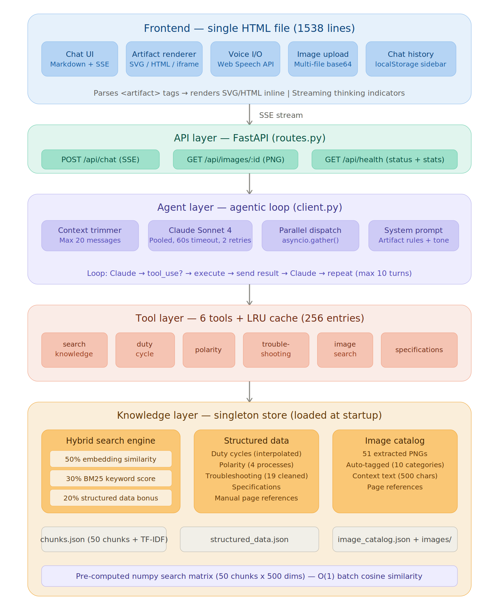
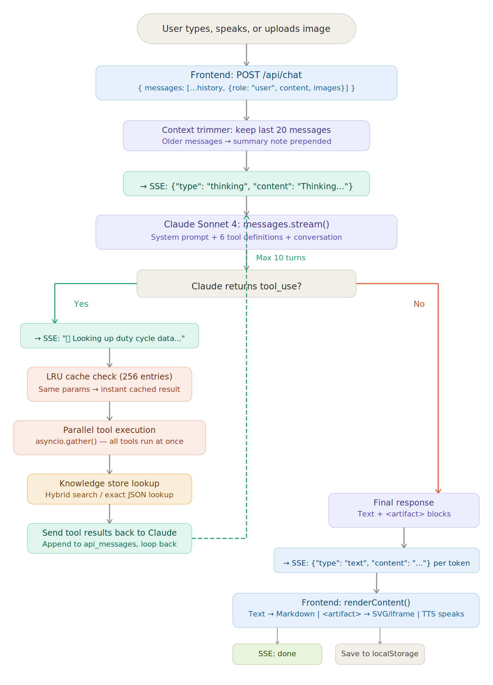
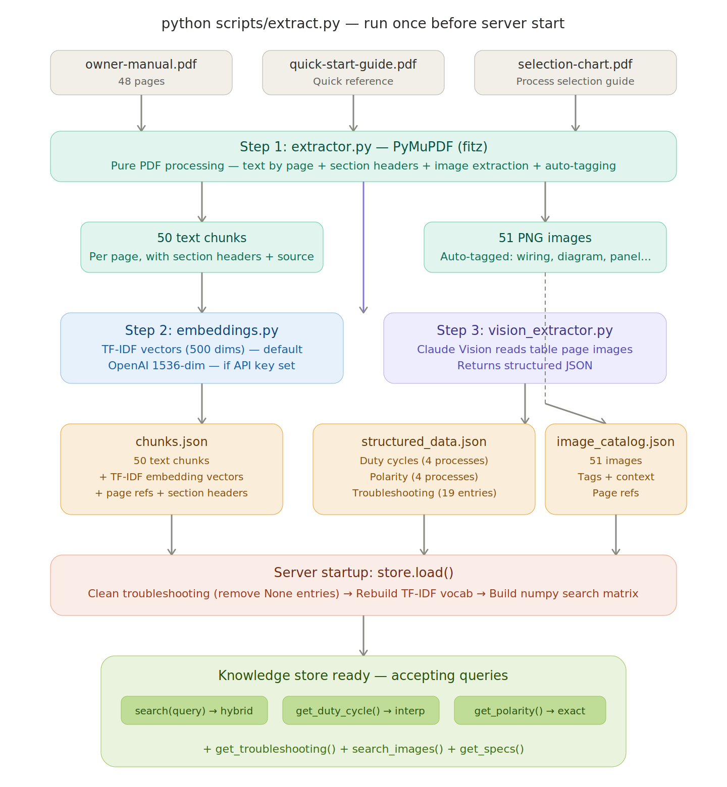

# Vulcan OmniPro 220 — Multimodal Expert Agent

> **Live Demo:** [https://prox-challenge-production.up.railway.app/](https://prox-challenge-production.up.railway.app/)

An AI-powered technical advisor for the Vulcan OmniPro 220 multiprocess welding system. Ask it anything about setup, polarity, duty cycles, troubleshooting — and it answers with **generated diagrams, interactive calculators, and manual images**, not just text.

 

---

## Table of Contents

- [Quick Start](#quick-start)
- [What It Does](#what-it-does)
- [System Architecture](#system-architecture)
- [Request Flow](#request-flow)
- [Knowledge Extraction Pipeline](#knowledge-extraction-pipeline)
- [Hybrid Search Engine](#hybrid-search-engine)
- [Caching & Performance](#caching--performance)
- [Parallelism & Concurrency](#parallelism--concurrency)
- [Docker & Deployment](#docker--deployment)
- [Tool System](#tool-system)
- [Artifact Rendering Pipeline](#artifact-rendering-pipeline)
- [Context Management](#context-management)
- [Design Decisions](#design-decisions)
- [Project Structure](#project-structure)
- [API Reference](#api-reference)
- [Testing](#testing)
- [Tech Stack](#tech-stack)

---

## Quick Start

```bash
git clone https://github.com/tchalikanti1705/prox-challenge
cd prox-challenge
cp .env.example .env          # Add your ANTHROPIC_API_KEY
pip install -r requirements.txt
cd backend && python app.py   # Server starts on http://localhost:8000
```

Open **http://localhost:8000** in your browser. That's it.

Or try the live deployment: **https://prox-challenge-production.up.railway.app/**

> **Requirements:** Python 3.10+, Anthropic API key  
> **Optional:** `OPENAI_API_KEY` in `.env` for OpenAI embeddings (auto-detected)  
> **No build step.** No npm. No Docker required. Clone → install → run.

### Docker

```bash
docker compose up --build     # Starts on http://localhost:8000
```

### Railway (Production)

Push to GitHub → Railway auto-deploys via `railway.json`. Set `ANTHROPIC_API_KEY` as env variable in Railway dashboard.

---

## What It Does

This isn't a chatbot that describes things in paragraphs. When you ask about polarity, **it draws you the wiring diagram**. When you ask about duty cycles, **it renders an interactive table with your query highlighted**. When you ask about troubleshooting, **it generates a visual flowchart**.

### Example: "What polarity do I need for TIG welding?"

The agent:
1. Calls `lookup_polarity` tool → gets exact data: DCEN, torch → negative, ground → positive
2. Generates an SVG wiring diagram showing which cable goes in which socket
3. Explains it in plain English underneath

### Example: "What's the duty cycle for MIG at 200A on 240V?"

The agent:
1. Calls `lookup_duty_cycle` tool → gets the exact percentage from the manual
2. Generates an HTML table showing all MIG duty cycles at 240V with the 200A row highlighted
3. Explains what duty cycle means in practical terms

### Example: "I'm getting porosity in my flux-cored welds"

The agent:
1. Calls `get_troubleshooting` → gets causes and fixes from the troubleshooting matrix
2. Generates an SVG flowchart walking through each diagnostic step
3. Offers to go deeper on any specific cause

---

## System Architecture



### High-Level Overview

```
┌─────────────────────────────────────────────────────────────────────┐
│                        CLIENT (Browser)                             │
│                                                                     │
│  ┌──────────┐ ┌───────────┐ ┌──────────┐ ┌──────────┐ ┌─────────┐ │
│  │ Chat UI  │ │ Artifact  │ │ Voice    │ │ Image    │ │ History │ │
│  │          │ │ Renderer  │ │ I/O      │ │ Upload   │ │ (local) │ │
│  │ Markdown │ │ SVG/HTML/ │ │ Web      │ │ Multi-   │ │ Storage │ │
│  │ + Stream │ │ Fullscreen│ │ Speech   │ │ file     │ │ Sidebar │ │
│  └────┬─────┘ └─────┬─────┘ └────┬─────┘ └─────┬────┘ └────┬────┘ │
│       └──────────────┴────────────┴─────────────┴───────────┘      │
│                              │                                      │
│                    POST /api/chat (JSON body)                       │
│                    ← SSE stream (text + thinking events)            │
└──────────────────────────────┼──────────────────────────────────────┘
                               │
┌──────────────────────────────┼──────────────────────────────────────┐
│                        BACKEND (FastAPI)                            │
│                              │                                      │
│  ┌───────────────────────────▼───────────────────────────────────┐  │
│  │                     API Layer (routes.py)                      │  │
│  │  POST /api/chat        GET /api/images/:id    GET /api/health │  │
│  │  (SSE streaming)       (static PNG)           (status JSON)   │  │
│  └───────────────────────────┬───────────────────────────────────┘  │
│                              │                                      │
│  ┌───────────────────────────▼───────────────────────────────────┐  │
│  │                    Agent Layer (client.py)                     │  │
│  │                                                               │  │
│  │  ┌─────────────┐    ┌──────────────┐    ┌──────────────────┐  │  │
│  │  │  Context     │    │  Anthropic   │    │  Tool Execution  │  │  │
│  │  │  Trimmer     │───▶│  Streaming   │───▶│  (parallel +     │  │  │
│  │  │  (20 msg cap)│    │  Client      │    │   LRU cached)    │  │  │
│  │  └─────────────┘    │  (pooled,    │    └────────┬─────────┘  │  │
│  │                      │   60s timeout│             │            │  │
│  │                      │   2 retries) │◀────────────┘            │  │
│  │                      └──────────────┘  loop until end_turn    │  │
│  └───────────────────────────┬───────────────────────────────────┘  │
│                              │                                      │
│  ┌───────────────────────────▼───────────────────────────────────┐  │
│  │                    Tool Layer (6 tools)                        │  │
│  │                                                               │  │
│  │  ┌───────────┐ ┌───────────┐ ┌───────────┐ ┌──────────────┐  │  │
│  │  │  search   │ │  duty     │ │  polarity │ │  trouble-    │  │  │
│  │  │  knowledge│ │  cycle    │ │  lookup   │ │  shooting    │  │  │
│  │  └─────┬─────┘ └─────┬─────┘ └─────┬─────┘ └──────┬───────┘  │  │
│  │  ┌─────┴─────┐ ┌─────┴─────┐       │              │          │  │
│  │  │  image    │ │  specs    │       │              │          │  │
│  │  │  search   │ │  lookup   │       │              │          │  │
│  │  └─────┬─────┘ └─────┬─────┘       │              │          │  │
│  │        └──────────────┴─────────────┴──────────────┘          │  │
│  └───────────────────────────┬───────────────────────────────────┘  │
│                              │                                      │
│  ┌───────────────────────────▼───────────────────────────────────┐  │
│  │               Knowledge Layer (store.py)                      │  │
│  │                                                               │  │
│  │  ┌──────────────────┐  ┌──────────────┐  ┌────────────────┐  │  │
│  │  │  Hybrid Search   │  │  Structured  │  │  Image Catalog │  │  │
│  │  │  Engine          │  │  Data Store  │  │                │  │  │
│  │  │                  │  │              │  │  51 images     │  │  │
│  │  │ ┌─────────────┐  │  │ Duty cycles │  │  with tags,    │  │  │
│  │  │ │50% Embedding│  │  │ Polarity    │  │  context,      │  │  │
│  │  │ │30% BM25     │  │  │ Specs       │  │  page refs     │  │  │
│  │  │ │20% Struct   │  │  │ Troubleshoot│  │                │  │  │
│  │  │ └─────────────┘  │  │ (19 cleaned)│  │                │  │  │
│  │  │                  │  │              │  │                │  │  │
│  │  │ Pre-computed     │  │ Interpolation│  │                │  │  │
│  │  │ numpy matrix     │  │ for in-betw  │  │                │  │  │
│  │  │ (51 × 500 dims) │  │ amperages    │  │                │  │  │
│  │  └──────────────────┘  └──────────────┘  └────────────────┘  │  │
│  └───────────────────────────────────────────────────────────────┘  │
└─────────────────────────────────────────────────────────────────────┘
```

### Layer Responsibilities

| Layer | Files | Responsibility |
|-------|-------|----------------|
| **Frontend** | `frontend/index.html` | Chat UI, artifact renderer (SVG/HTML/fullscreen modal + zoom), voice I/O (Web Speech API), image upload, chat history (localStorage) |
| **API** | `api/routes.py`, `api/models.py` | 3 endpoints, Pydantic validation, SSE streaming |
| **Agent** | `agent/client.py`, `agent/prompts.py` | Agentic tool-use loop (max 10 turns), context trimming, parallel tool dispatch |
| **Tools** | `agent/tools/*.py`, `agent/tools/__init__.py` | 6 specialized tools with LRU cache, JSON schema definitions for Claude |
| **Knowledge** | `knowledge/store.py`, `knowledge/embeddings.py` | Hybrid search engine, pre-computed search index, singleton data store |
| **Extraction** | `knowledge/extractor.py`, `knowledge/vision_extractor.py`, `scripts/extract.py` | One-time PDF → JSON pipeline (text chunks, images, structured data via Claude Vision) |

---

## Request Flow



### Complete Request Lifecycle

```
User types: "What's the duty cycle for MIG at 200A on 240V?"
│
│ ① FRONTEND
├─► Captures message, appends to chat history
├─► POST /api/chat { messages: [...history, {role:"user", content:"..."}] }
├─► Opens EventSource for SSE stream
│
│ ② API LAYER (routes.py)
├─► Validates request via Pydantic (ChatRequest model)
├─► Creates SSE StreamingResponse
├─► Calls agent.client.chat() — async generator
│
│ ③ CONTEXT MANAGEMENT (client.py)
├─► _trim_history(): if >20 messages, keep last 20 + summary note
├─► _build_messages(): converts history + images to Anthropic format
│
│ ④ AGENT LOOP — Turn 1 (client.py)
├─► yield ("thinking", "Thinking...")  ──────────────────► SSE: thinking event
├─► _client.messages.stream() to Claude Opus 4
│   ├─ system: SYSTEM_PROMPT (tool rules + artifact instructions)
│   ├─ tools: 6 TOOL_DEFINITIONS (JSON schemas)
│   └─ messages: trimmed conversation history
│
│ ⑤ CLAUDE DECIDES: "I need lookup_duty_cycle"
├─► Returns tool_use content block
├─► No text tokens streamed yet (tool call only)
│
│ ⑥ PARALLEL TOOL EXECUTION (client.py + tools/__init__.py)
├─► yield ("thinking", "📊 Looking up duty cycle data...")  ─► SSE: thinking event
├─► LRU cache check: _execute_cached("lookup_duty_cycle", params_json)
│   ├─ CACHE HIT → return cached result instantly
│   └─ CACHE MISS ↓
├─► asyncio.to_thread(execute_tool, ...) — non-blocking
│   └─► store.get_duty_cycle("MIG", "240V", "200A")
│       ├─ Exact match in structured_data["duty_cycles"]["MIG"]["240V"]["200A"]
│       └─ Returns: {"process":"MIG","voltage":"240V","amperage":"200A",
│                     "duty_cycle":25,"all_ratings":{...},
│                     "manual_reference":"Owner's manual, duty cycle rating table"}
├─► Tool result appended to api_messages
│
│ ⑦ AGENT LOOP — Turn 2 (client.py)
├─► yield ("thinking", "Analyzing results...")  ────────► SSE: thinking event
├─► _client.messages.stream() with tool result in context
│
│ ⑧ CLAUDE GENERATES RESPONSE
├─► Streams tokens as they arrive:
│   yield ("text", "For MIG welding at ")  ─────────────► SSE: text event
│   yield ("text", "200A on 240V, the ")   ─────────────► SSE: text event
│   yield ("text", "duty cycle is **25%**")─────────────► SSE: text event
│   yield ("text", "...<artifact type=\"html\" title=\"MIG Duty Cycle Table\">")
│   yield ("text", "<table>...</table></artifact>")
│
│ ⑨ STREAM ENDS
├─► yield ("done", "")  ────────────────────────────────► SSE: done event
│
│ ⑩ FRONTEND RENDERING
├─► renderContent() parses response text:
│   ├─ Text portions → Markdown → rendered HTML
│   ├─ <artifact type="html"> → sandboxed iframe with expand button
│   └─ <artifact type="svg"> → DOMParser → sanitized inline SVG
├─► Artifact expand button: click → fullscreen modal with zoom (50%-200%)
├─► Chat saved to localStorage
└─► If TTS enabled → Web Speech API reads text aloud
```

### Multi-Tool Request (Parallel Execution)

```
User: "Show me TIG polarity and a wiring diagram"
│
├─► Claude decides: needs BOTH lookup_polarity AND search_manual_images
│
│   ┌──────────────────────────────────────────┐
│   │        asyncio.gather() — PARALLEL       │
│   │                                          │
│   │  ┌─────────────────┐ ┌─────────────────┐ │
│   │  │  lookup_polarity │ │ search_manual   │ │
│   │  │  ("TIG")        │ │ _images("TIG    │ │
│   │  │                 │ │  wiring")       │ │
│   │  │  LRU cache      │ │  LRU cache     │ │
│   │  │  check ──►      │ │  check ──►     │ │
│   │  │  store.get_     │ │  store.search_  │ │
│   │  │  polarity()     │ │  images()       │ │
│   │  └────────┬────────┘ └────────┬────────┘ │
│   │           │                   │          │
│   │           └────────┬──────────┘          │
│   │                    │                     │
│   │           All results returned           │
│   │           simultaneously                 │
│   └──────────────────────────────────────────┘
│
├─► Both tool results sent back to Claude in one message
└─► Claude generates text + SVG diagram using both data sources
```

---

## Knowledge Extraction Pipeline



One-time pipeline that transforms raw PDFs into queryable JSON.

```
┌─────────────────────────────────────────────────────────────────┐
│                    EXTRACTION PIPELINE                           │
│                    python scripts/extract.py                     │
│                                                                 │
│  ┌───────────────────────────────────────────────────────────┐  │
│  │  INPUT: 3 PDF files                                       │  │
│  │  ├── owner-manual.pdf (48 pages)                          │  │
│  │  ├── quick-start-guide.pdf                                │  │
│  │  └── selection-chart.pdf                                  │  │
│  └──────────────────────┬────────────────────────────────────┘  │
│                         │                                       │
│            ┌────────────┼────────────┐                          │
│            │            │            │                           │
│            ▼            ▼            ▼                           │
│  ┌─────────────┐ ┌───────────┐ ┌──────────────┐                │
│  │  Step 1:    │ │  Step 2:  │ │  Step 3:     │                │
│  │  Text       │ │  Image    │ │  Vision      │                │
│  │  Extraction │ │  Extract  │ │  Extraction  │                │
│  │             │ │           │ │              │                │
│  │  PyMuPDF    │ │  PyMuPDF  │ │  Claude API  │                │
│  │  per-page   │ │  xref     │ │  reads table │                │
│  │  chunking   │ │  extract  │ │  images      │                │
│  │  + section  │ │  + auto   │ │              │                │
│  │  detection  │ │  tagging  │ │  Duty cycles │                │
│  │             │ │  (wiring, │ │  Polarity    │                │
│  │             │ │  diagram, │ │  Specs       │                │
│  │             │ │  panel..) │ │  Trouble-    │                │
│  │             │ │           │ │  shooting    │                │
│  └──────┬──────┘ └─────┬─────┘ └──────┬───────┘                │
│         │              │              │                         │
│         ▼              ▼              ▼                         │
│  ┌─────────────┐ ┌───────────┐ ┌──────────────┐                │
│  │  Step 4:    │ │           │ │              │                │
│  │  TF-IDF     │ │  51 PNG   │ │  Merge +     │                │
│  │  Embedding  │ │  files    │ │  validate    │                │
│  │  Generation │ │  saved    │ │  with        │                │
│  │  (500 dims) │ │  to disk  │ │  defaults    │                │
│  └──────┬──────┘ └─────┬─────┘ └──────┬───────┘                │
│         │              │              │                         │
│         ▼              ▼              ▼                         │
│  ┌──────────────────────────────────────────────────────────┐   │
│  │  OUTPUT: knowledge/data/                                  │   │
│  │                                                          │   │
│  │  chunks.json ─────── 51 text chunks with TF-IDF vectors  │   │
│  │  image_catalog.json ─ 51 images with tags + context       │   │
│  │  structured_data.json ─ duty cycles, polarity, specs,     │   │
│  │                         troubleshooting (19 entries)      │   │
│  │  images/*.png ────── extracted page images                │   │
│  └──────────────────────────────────────────────────────────┘   │
└─────────────────────────────────────────────────────────────────┘
```

### structured_data.json Schema

```
structured_data.json
├── duty_cycles
│   ├── MIG
│   │   ├── 240V: { "100A": 40, "115A": 100, "200A": 25 }
│   │   └── 120V: { "75A": 100, "100A": 40 }
│   ├── Flux-Cored
│   ├── TIG
│   └── Stick
├── polarity
│   ├── MIG:        { type: "DCEP", torch_socket: "positive", ... }
│   ├── Flux-Cored: { type: "DCEP", ... }
│   ├── TIG:        { type: "DCEN", torch_socket: "negative", ... }
│   └── Stick:      { type: "DCEP", ... }
├── specifications
│   └── { input_voltage, processes, max_output, wire_sizes, ... }
└── troubleshooting
    └── [ { problem, causes: [], fixes: [] }, ... ] (19 entries)
```

---

## Hybrid Search Engine

The search system combines three scoring methods to handle different query types.

```
┌──────────────────────────────────────────────────────────────┐
│                    HYBRID SEARCH PIPELINE                     │
│                    store.search(query, top_k)                 │
│                                                              │
│  Input: "how do I connect cables for TIG"                    │
│                                                              │
│  ┌────────────────────────┬─────────────────┬──────────────┐ │
│  │   Score 1 (50%)        │  Score 2 (30%)  │ Score 3 (20%)│ │
│  │   EMBEDDING SIMILARITY │  BM25 KEYWORD   │ STRUCTURED   │ │
│  │                        │  MATCHING       │ DATA BONUS   │ │
│  │                        │                 │              │ │
│  │  query ──► embedding   │ query ──► tokens│ query ──►    │ │
│  │           (TF-IDF or   │ chunks ──►tokens│ intent       │ │
│  │            OpenAI)     │                 │ detection    │ │
│  │           │            │   BM25 formula: │              │ │
│  │  ┌────────▼─────────┐  │   tf(k+1)      │ "polarity"   │ │
│  │  │ Pre-computed      │  │   ──────────── │ "duty cycle" │ │
│  │  │ Normalized Matrix │  │   tf+k(1-b+   │ "specs"      │ │
│  │  │ (51 × 500)        │  │   b·dl/avgdl) │ "trouble-    │ │
│  │  │                   │  │               │  shoot"      │ │
│  │  │ Single matmul:    │  │ Catches exact │              │ │
│  │  │ scores = M @ q    │  │ terms like    │ Boosts chunks│ │
│  │  │                   │  │ "OmniPro 220" │ that match   │ │
│  │  │ Finds "electrode  │  │ "model 57812" │ the detected │ │
│  │  │ negative config"  │  │               │ intent       │ │
│  │  │ for "connect      │  │ Normalized to │              │ │
│  │  │ cables" query     │  │ 0.0 – 1.0     │ 0.0 – 1.0   │ │
│  │  └──────────────────┘  │               │              │ │
│  │  0.0 – 1.0            │               │              │ │
│  └────────────┬───────────┴───────┬───────┴──────┬───────┘ │
│               │                   │              │         │
│               ▼                   ▼              ▼         │
│  ┌──────────────────────────────────────────────────────┐  │
│  │  FUSION: final = 0.5×emb + 0.3×kw + 0.2×struct      │  │
│  │  Sort by score → return top_k results                │  │
│  │  Each result includes manual_reference (page number) │  │
│  └──────────────────────────────────────────────────────┘  │
└──────────────────────────────────────────────────────────────┘
```

### Embedding Modes

| Mode | Dimensions | Quality | Requirement |
|------|-----------|---------|-------------|
| **TF-IDF** (default) | 500 | Good — catches topical words, no semantic understanding | None |
| **OpenAI** (optional) | 1,536 | Excellent — understands meaning ("connect cables" ≈ "electrode configuration") | `OPENAI_API_KEY` in `.env` |

OpenAI embeddings auto-enable when the key is present. Cost: ~$0.001 for the entire manual.

### Search Index (Pre-computed at Startup)

```
Server startup:
  store.load()
    ├── Load chunks.json (51 chunks with embeddings)
    ├── Clean troubleshooting (remove 37 entries with null problems → 19 remain)
    ├── Rebuild TF-IDF vocabulary (500 terms from corpus)
    └── Build search index:
          embeddings = np.array([c["embedding"] for c in chunks])   # (51, 500)
          norms = np.linalg.norm(embeddings, axis=1, keepdims=True)
          index = embeddings / norms                                # normalized

Query time:
  q = normalize(get_query_embedding(query))
  scores = index @ q                                                # single matmul
  # 50x faster than 51 individual cosine_similarity() calls
```

---

## Caching & Performance

### Three-Layer Cache Architecture

```
┌─────────────────────────────────────────────────────────┐
│                   CACHE LAYERS                           │
│                                                         │
│  Layer 1: LRU Tool Cache (tools/__init__.py)            │
│  ┌──────────────────────────────────────────────────┐   │
│  │  @lru_cache(maxsize=256)                          │   │
│  │  Key: (tool_name, json.dumps(params, sort_keys))  │   │
│  │                                                   │   │
│  │  "What polarity for TIG?" → cache hit             │   │
│  │  Same tool + same params = instant return         │   │
│  │  No knowledge store access, no computation        │   │
│  │                                                   │   │
│  │  Eviction: LRU (least recently used)              │   │
│  └──────────────────────────────────────────────────┘   │
│                                                         │
│  Layer 2: Pre-computed Search Index (embeddings.py)     │
│  ┌──────────────────────────────────────────────────┐   │
│  │  Normalized numpy matrix built once at startup    │   │
│  │  (51 chunks × 500 dims) = 102 KB in memory       │   │
│  │                                                   │   │
│  │  Query: single matrix multiply O(n·d)             │   │
│  │  vs. 51 individual cosine_similarity calls        │   │
│  └──────────────────────────────────────────────────┘   │
│                                                         │
│  Layer 3: In-Memory Knowledge Store (store.py)          │
│  ┌──────────────────────────────────────────────────┐   │
│  │  Singleton loaded once at startup                 │   │
│  │  All JSON files held in memory                    │   │
│  │  Zero disk I/O during request handling            │   │
│  │                                                   │   │
│  │  chunks: List[Dict]          # 51 items           │   │
│  │  structured_data: Dict       # tables + specs     │   │
│  │  image_catalog: List[Dict]   # 51 images          │   │
│  └──────────────────────────────────────────────────┘   │
│                                                         │
│  Result: Tool execution = O(1) cache hit or             │
│          O(n·d) matrix operation. No disk. No network.  │
└─────────────────────────────────────────────────────────┘
```

### Performance Numbers

| Operation | Without optimization | With optimization | Speedup |
|-----------|---------------------|-------------------|---------|
| Semantic search (51 chunks) | 51 cosine_similarity calls | 1 matrix multiply | ~50x |
| Repeated tool call | Full search + computation | LRU cache lookup | ~1000x |
| Tool execution (multi-tool) | Sequential (N × latency) | Parallel asyncio.gather | Nx |
| Knowledge load | JSON parse per request | In-memory singleton | ∞ (amortized) |

---

## Parallelism & Concurrency

### Concurrency Model

```
┌──────────────────────────────────────────────────────────────────┐
│                    CONCURRENCY ARCHITECTURE                       │
│                                                                  │
│  FastAPI (async) ──► Uvicorn (ASGI) ──► Event Loop               │
│                                                                  │
│  ┌─────────────────────────────────────────────────────────────┐ │
│  │  Request Handler (async def chat_endpoint)                   │ │
│  │                                                             │ │
│  │  ┌──────────────────────────────────────────────────────┐   │ │
│  │  │  Agent Loop (async generator)                         │   │ │
│  │  │                                                      │   │ │
│  │  │  Turn 1: Claude API call ← non-blocking (httpx)      │   │ │
│  │  │          Streaming ← async for event in stream       │   │ │
│  │  │                                                      │   │ │
│  │  │  Tool Execution:                                     │   │ │
│  │  │  ┌──────────────────────────────────────────────┐    │   │ │
│  │  │  │  asyncio.gather(                              │    │   │ │
│  │  │  │    asyncio.to_thread(tool_1),  ← thread pool  │    │   │ │
│  │  │  │    asyncio.to_thread(tool_2),  ← thread pool  │    │   │ │
│  │  │  │    asyncio.to_thread(tool_3),  ← thread pool  │    │   │ │
│  │  │  │  )                                            │    │   │ │
│  │  │  │                                               │    │   │ │
│  │  │  │  All tools run concurrently in thread pool    │    │   │ │
│  │  │  │  Main event loop stays free for other requests│    │   │ │
│  │  │  └──────────────────────────────────────────────┘    │   │ │
│  │  │                                                      │   │ │
│  │  │  Turn 2: Claude API call with tool results           │   │ │
│  │  │          Stream text tokens → SSE events             │   │ │
│  │  └──────────────────────────────────────────────────────┘   │ │
│  └─────────────────────────────────────────────────────────────┘ │
│                                                                  │
│  Connection Pooling:                                             │
│  ┌──────────────────────────────────────────────────────────┐    │
│  │  AsyncAnthropic(                                         │    │
│  │    api_key=...,                                          │    │
│  │    timeout=60.0,        # Connection + read timeout      │    │
│  │    max_retries=2,       # Auto-retry on transient errors │    │
│  │  )                                                       │    │
│  │  Single instance, reused across all requests             │    │
│  │  httpx connection pool under the hood                    │    │
│  └──────────────────────────────────────────────────────────┘    │
└──────────────────────────────────────────────────────────────────┘
```

### Why asyncio.to_thread for tools?

Tool execution reads from in-memory Python dicts (the knowledge store). These are CPU-bound operations that would block the async event loop if run directly. `asyncio.to_thread()` offloads them to the default thread pool executor, keeping the event loop free for SSE streaming and handling concurrent requests.

---

## Docker & Deployment

### Docker Architecture

```
┌─────────────────────────────────────────────────────────────┐
│                    docker-compose.yml                         │
│                                                             │
│  ┌────────────────────────────────┐  ┌───────────────────┐  │
│  │  backend (Python 3.11-slim)    │  │  frontend (nginx)  │  │
│  │                                │  │  (optional)        │  │
│  │  Port: 8000                    │  │  Port: 3000        │  │
│  │                                │  │                    │  │
│  │  ┌──────────────────────────┐  │  │  Serves static     │  │
│  │  │  Dockerfile              │  │  │  index.html via    │  │
│  │  │                         │  │  │  nginx:alpine      │  │
│  │  │  FROM python:3.11-slim  │  │  │                    │  │
│  │  │  WORKDIR /app           │  │  │  Proxies /api/*    │  │
│  │  │                         │  │  │  to backend:8000   │  │
│  │  │  pip install reqs       │  │  │                    │  │
│  │  │  COPY backend/ frontend/│  │  └───────────────────┘  │
│  │  │  COPY files/            │  │                         │
│  │  │                         │  │  Healthcheck:           │
│  │  │  WORKDIR /app/backend   │  │  GET /api/health        │
│  │  │  CMD python app.py      │  │  interval: 10s          │
│  │  │                         │  │  timeout: 5s            │
│  │  │  # Knowledge base is    │  │  retries: 5             │
│  │  │  # pre-extracted and    │  │                         │
│  │  │  # ships with the image │  │                         │
│  │  └──────────────────────────┘  │                         │
│  │                                │                         │
│  │  Volume:                       │                         │
│  │  ./backend/knowledge/data      │                         │
│  │  → /app/backend/knowledge/data │                         │
│  │                                │                         │
│  │  Env:                          │                         │
│  │  ANTHROPIC_API_KEY (required)  │                         │
│  │  OPENAI_API_KEY (optional)     │                         │
│  │  PORT=8000                     │                         │
│  └────────────────────────────────┘                         │
└─────────────────────────────────────────────────────────────┘
```

**Note:** The backend container serves both the API _and_ the frontend (via FastAPI's StaticFiles mount). The nginx frontend service is optional and only needed if you want to separate concerns in production.

### Railway Deployment

```
┌──────────────────────────────────────────────────────────┐
│                    RAILWAY (Production)                    │
│                                                          │
│  railway.json                                            │
│  ├── builder: DOCKERFILE                                 │
│  ├── healthcheckPath: /api/health                        │
│  └── restartPolicy: ON_FAILURE (3 retries)               │
│                                                          │
│  Deploy flow:                                            │
│  git push → Railway detects Dockerfile                   │
│           → Builds image (python:3.11-slim)              │
│           → Starts container                             │
│           → Healthcheck passes                           │
│           → Routes traffic to container                  │
│                                                          │
│  Environment Variables (Railway Dashboard):              │
│  ├── ANTHROPIC_API_KEY = sk-ant-...                      │
│  ├── OPENAI_API_KEY = sk-... (optional)                  │
│  └── PORT = (auto-assigned by Railway)                   │
│                                                          │
│  Startup sequence:                                       │
│  1. Config loads (.env or env vars)                      │
│  2. Knowledge store loads JSON (51 chunks, 51 images)    │
│  3. Troubleshooting cleaned (37 entries removed)         │
│  4. TF-IDF vocabulary rebuilt (500 terms)                │
│  5. Search index pre-computed (51×500 matrix)            │
│  6. Uvicorn binds to 0.0.0.0:$PORT                      │
│  7. Healthcheck: GET /api/health → 200 OK                │
└──────────────────────────────────────────────────────────┘
```

---

## Tool System

### Tool Registration & Execution

```
┌────────────────────────────────────────────────────────────────┐
│                    TOOL SYSTEM                                  │
│                                                                │
│  Registration (tools/__init__.py):                             │
│  ┌──────────────────────────────────────────────────────────┐  │
│  │  TOOL_DEFINITIONS = [                                     │  │
│  │    search_tool.TOOL_DEFINITION,     # JSON schema         │  │
│  │    duty_cycle_tool.TOOL_DEFINITION, # sent to Claude      │  │
│  │    polarity_tool.TOOL_DEFINITION,   # so it knows what    │  │
│  │    troubleshoot_tool.TOOL_DEFINITION, # tools exist       │  │
│  │    image_tool.TOOL_DEFINITION,                            │  │
│  │    specs_tool.TOOL_DEFINITION,                            │  │
│  │  ]                                                        │  │
│  └──────────────────────────────────────────────────────────┘  │
│                                                                │
│  Execution with LRU Cache:                                     │
│  ┌──────────────────────────────────────────────────────────┐  │
│  │  execute_tool(name, params)                               │  │
│  │    │                                                      │  │
│  │    ├── params_json = json.dumps(params, sort_keys=True)   │  │
│  │    │                                                      │  │
│  │    └── @lru_cache(maxsize=256)                            │  │
│  │        _execute_cached(name, params_json)                 │  │
│  │          │                                                │  │
│  │          ├── CACHE HIT → return instantly                 │  │
│  │          │                                                │  │
│  │          └── CACHE MISS → TOOL_EXECUTORS[name](params)    │  │
│  │                           → store result in cache         │  │
│  └──────────────────────────────────────────────────────────┘  │
└────────────────────────────────────────────────────────────────┘
```

### Tool Reference

| Tool | Trigger | Data Source | Special Features |
|------|---------|-------------|-----------------|
| `search_knowledge` | General manual questions | Hybrid search (embedding + BM25 + structured) | Top-5 results with page references |
| `lookup_duty_cycle` | Duty cycle / amperage / weld time | `structured_data["duty_cycles"]` | **Interpolation** for in-between amperages |
| `lookup_polarity` | Wiring / connections / terminals | `structured_data["polarity"]` | Per-process socket mapping |
| `get_troubleshooting` | Problems / defects / diagnosis | `structured_data["troubleshooting"]` | 3-pass fuzzy matching (exact → word overlap → search) |
| `search_manual_images` | Visual content needed | `image_catalog.json` | Tag + keyword filtering |
| `get_specifications` | Machine capability questions | `structured_data["specifications"]` | All specs as JSON |

### Duty Cycle Interpolation

```
Known data points:         User asks for 150A:

  115A ──── 100%           Linear interpolation between
                           115A (100%) and 200A (25%):
                    ×
  150A ──── ???%           ratio = (150 - 115) / (200 - 115) = 0.41
                           duty = 100 + 0.41 × (25 - 100) = 69.2%
                    ×
  200A ──── 25%            → Returns 69.2% (interpolated: true)
```

---

## Artifact Rendering Pipeline

### How Artifacts Flow from Claude to Screen

```
┌──────────────────────────────────────────────────────────────────┐
│                 ARTIFACT RENDERING PIPELINE                       │
│                                                                  │
│  ① Claude generates:                                             │
│  "For TIG welding...<artifact type="svg" title="TIG Polarity">  │
│  <svg viewBox="0 0 600 400">...</svg></artifact>"                │
│                                                                  │
│  ② Frontend renderContent() splits text:                         │
│  ┌────────────────────────────┐ ┌─────────────────────────────┐  │
│  │  Text: "For TIG welding..." │ │ Artifact: type=svg          │  │
│  │  → marked() → HTML render  │ │ title="TIG Polarity"        │  │
│  │  → chat bubble             │ │ content="<svg>...</svg>"     │  │
│  └────────────────────────────┘ └─────────────┬───────────────┘  │
│                                               │                  │
│  ③ renderArtifact(container, type, title, content):              │
│  ┌────────────────────────────────────────────┴───────────────┐  │
│  │  ┌──────────────────────────────────────────────────────┐  │  │
│  │  │  Artifact Card                                        │  │
│  │  │  ┌───────────────────────────────────┬────────────┐   │  │
│  │  │  │  📊 TIG Polarity                  │ ⛶ Expand   │   │  │
│  │  │  └───────────────────────────────────┴────────────┘   │  │
│  │  │  ┌────────────────────────────────────────────────┐   │  │
│  │  │  │                                                │   │  │
│  │  │  │  type="svg" → DOMParser → sanitize (remove     │   │  │
│  │  │  │               <script>) → inline <svg>          │   │  │
│  │  │  │                                                │   │  │
│  │  │  │  type="html" → sandboxed <iframe>               │   │  │
│  │  │  │                (allow-scripts only)             │   │  │
│  │  │  │                auto-resize to content           │   │  │
│  │  │  │                                                │   │  │
│  │  │  │  type="image" →    │   │  │
│  │  │  │                                                │   │  │
│  │  │  └────────────────────────────────────────────────┘   │  │
│  │  └──────────────────────────────────────────────────────┘  │  │
│  └────────────────────────────────────────────────────────────┘  │
│                                                                  │
│  ④ Click "⛶ Expand" → openArtifactModal():                      │
│  ┌──────────────────────────────────────────────────────────┐    │
│  │  ┌────────────────────────────────────────────────────┐  │    │
│  │  │  Fullscreen Modal                                   │  │    │
│  │  │  ┌──────────────────────────────┬──────────────┐   │  │    │
│  │  │  │ TIG Polarity                 │ -Zoom 100%   │   │  │    │
│  │  │  │                              │ +Zoom  ✕     │   │  │    │
│  │  │  └──────────────────────────────┴──────────────┘   │  │    │
│  │  │  ┌──────────────────────────────────────────────┐  │  │    │
│  │  │  │                                              │  │  │    │
│  │  │  │  Rendered SVG/HTML at larger size             │  │  │    │
│  │  │  │  CSS transform: scale(zoomLevel/100)          │  │  │    │
│  │  │  │  Zoom range: 50% – 200% (25% steps)          │  │  │    │
│  │  │  │                                              │  │  │    │
│  │  │  │  Close: ✕ button, Escape key, backdrop click │  │  │    │
│  │  │  └──────────────────────────────────────────────┘  │  │    │
│  │  └────────────────────────────────────────────────────┘  │    │
│  └──────────────────────────────────────────────────────────┘    │
└──────────────────────────────────────────────────────────────────┘
```

### During Streaming

Incomplete artifacts show a "Loading artifact..." placeholder. The frontend buffers text, and only renders the artifact once the closing `</artifact>` tag arrives. This prevents broken SVG/HTML from being injected mid-stream.

---

## Context Management

### Conversation Window Trimming

```
┌────────────────────────────────────────────────────────────┐
│            CONTEXT WINDOW MANAGEMENT                        │
│                                                            │
│  Problem: After 20+ messages, context window fills up      │
│           → API costs spike, latency increases             │
│                                                            │
│  Solution: _trim_history() in client.py                    │
│                                                            │
│  Before (25 messages):                                     │
│  ┌─────────────────────────────────────────────────────┐   │
│  │  msg 1 (user)                                        │   │
│  │  msg 2 (assistant)                                   │   │
│  │  msg 3 (user)        ← these 5 get trimmed           │   │
│  │  msg 4 (assistant)                                   │   │
│  │  msg 5 (user)                                        │   │
│  │  ─────────────────── trim line ──────────────────    │   │
│  │  msg 6 (user)                                        │   │
│  │  msg 7 (assistant)                                   │   │
│  │  ...                  ← last 20 kept                  │   │
│  │  msg 25 (user)                                       │   │
│  └─────────────────────────────────────────────────────┘   │
│                                                            │
│  After:                                                    │
│  ┌─────────────────────────────────────────────────────┐   │
│  │  [System note: 5 earlier messages were trimmed.      │   │
│  │   The conversation continues below.]                 │   │
│  │  msg 6 (user)                                        │   │
│  │  msg 7 (assistant)                                   │   │
│  │  ...                                                 │   │
│  │  msg 25 (user)                                       │   │
│  └─────────────────────────────────────────────────────┘   │
│                                                            │
│  Config: MAX_CONVERSATION_MESSAGES = 20 (in config.py)     │
└────────────────────────────────────────────────────────────┘
```

---

## Design Decisions

### Why direct Anthropic API instead of Agent SDK?

The Claude Agent SDK wraps Claude Code's CLI — designed for code-editing agents that read/write files. Our use case is a **chat agent with tool use**, where `messages.stream()` gives us fine-grained control over the SSE stream and real-time token delivery.

### Why a single HTML file for the frontend?

The challenge says "we should be running your agent within 2 minutes." A React/Next.js app adds `npm install` (30+ seconds) and a build step. A single HTML file with inline CSS/JS: opens instantly from FastAPI's static file serving, zero build configuration, still supports artifact rendering, voice I/O, image upload, chat history, streaming, and fullscreen modal with zoom.

### Why pre-extracted knowledge (not runtime RAG)?

The manual doesn't change. Running extraction at startup would mean slower startup (30+ seconds), Claude Vision API calls on every restart (costs money), and risk of extraction failure blocking the server. Instead, extraction runs once, saves to JSON, and the server loads it in milliseconds.

### Why hybrid search instead of just embeddings?

Single-method search fails on different query types:
- **Embeddings alone** miss exact model numbers ("model 57812") — semantic similarity doesn't catch arbitrary identifiers
- **Keywords alone** miss semantic matches ("connect cables" ≠ "electrode negative configuration")
- **Structured data alone** only works for duty cycle / polarity / specs queries

The hybrid approach (50/30/20 weighted fusion) handles all three categories well.

### Why LRU caching on tools?

The knowledge base is static — same tool input always produces the same output. Many users ask similar questions ("TIG polarity", "MIG duty cycle at 240V"). The `@lru_cache` with 256 entry capacity ensures repeated tool calls return instantly without re-querying the knowledge store.

---

## Project Structure

```
prox-challenge/
├── frontend/
│   └── index.html                   # Single-file SPA (chat + artifacts + voice + history)
│
├── backend/
│   ├── app.py                       # FastAPI entry point + lifespan + static serving
│   ├── config.py                    # All settings (API keys, model, search weights, cache)
│   │
│   ├── agent/
│   │   ├── client.py                # Agentic loop: streaming + parallel tools + trimming
│   │   ├── prompts.py               # System prompt (behavior + artifact instructions)
│   │   └── tools/
│   │       ├── __init__.py          # Registry + LRU-cached execute_tool()
│   │       ├── search_tool.py       # Hybrid search over manual chunks
│   │       ├── duty_cycle_tool.py   # Exact lookup + interpolation
│   │       ├── polarity_tool.py     # Per-process socket mapping
│   │       ├── troubleshoot_tool.py # 3-pass fuzzy match
│   │       ├── image_tool.py        # Tag + keyword image search
│   │       └── specs_tool.py        # Full specifications JSON
│   │
│   ├── knowledge/
│   │   ├── store.py                 # KnowledgeStore singleton + hybrid search engine
│   │   ├── embeddings.py            # TF-IDF/OpenAI + BM25 + pre-computed matrix
│   │   ├── extractor.py             # PDF text + image extraction (PyMuPDF)
│   │   ├── vision_extractor.py      # Claude Vision for table pages → structured data
│   │   └── data/                    # Pre-extracted (ships with repo)
│   │       ├── chunks.json          # 51 text chunks with TF-IDF vectors
│   │       ├── structured_data.json # Duty cycles, polarity, specs, troubleshooting
│   │       ├── image_catalog.json   # 51 images with tags + context + page refs
│   │       └── images/              # Extracted PNGs
│   │
│   ├── api/
│   │   ├── routes.py                # 3 endpoints: /chat (SSE), /images/:id, /health
│   │   └── models.py                # Pydantic: ChatRequest, ChatMessage, HealthResponse
│   │
│   └── scripts/
│       └── extract.py               # One-time extraction pipeline CLI
│
├── files/                           # Source PDFs
│   ├── owner-manual.pdf
│   ├── quick-start-guide.pdf
│   └── selection-chart.pdf
│
├── Dockerfile                       # python:3.11-slim, serves both API + frontend
├── docker-compose.yml               # backend + optional nginx frontend
├── railway.json                     # Railway PaaS config (healthcheck, restart policy)
├── requirements.txt                 # All Python deps (pinned versions)
├── run.py                           # Development convenience launcher
└── .env.example                     # Template: ANTHROPIC_API_KEY=your-key-here
```

---

## API Reference

### POST /api/chat

Send a message and stream the response via Server-Sent Events.

**Request:**
```json
{
  "messages": [
    {"role": "user", "content": "What polarity for TIG?"},
    {"role": "assistant", "content": "For TIG welding..."},
    {"role": "user", "content": "Show me a diagram"}
  ]
}
```

**Response:** SSE stream
```
data: {"type": "thinking", "content": "🔌 Checking polarity settings..."}
data: {"type": "text", "content": "For TIG welding, you'll use "}
data: {"type": "text", "content": "DCEN polarity..."}
data: {"type": "text", "content": "<artifact type=\"svg\"..."}
data: {"type": "done"}
```

### GET /api/images/{image_id}

Serve an extracted manual image by ID. Returns `image/png`.

### GET /api/health

```json
{
  "status": "ok",
  "knowledge_loaded": true,
  "chunks_count": 51,
  "images_count": 51,
  "models": {
    "chat_model": "claude-opus-4-20250514",
    "embedding_model": "tfidf-500d",
    "search": "hybrid (embedding + BM25 + structured)"
  }
}
```

---

## Testing

Ask these questions to verify the system works end-to-end:

| Question | Expected behavior |
|----------|------------------|
| "What's the duty cycle for MIG at 200A on 240V?" | Exact number from manual + HTML duty cycle table |
| "What polarity for TIG welding?" | DCEN + SVG wiring diagram |
| "I'm getting porosity in my flux-cored welds" | Troubleshooting flowchart + causes/fixes |
| "Show me the front panel controls" | Manual image surfaced from catalog |
| "Can I weld aluminum with this machine?" | Nuanced answer about DC-only TIG limitation |
| "What about 150A MIG on 240V?" | Interpolated duty cycle (~69%) with note |

### Verify system health:

```bash
curl http://localhost:8000/api/health | python -m json.tool
```

---

## Tech Stack

| Component | Technology | Why |
|-----------|-----------|-----|
| LLM | Claude Opus 4 (`claude-opus-4-20250514`) | Best reasoning + tool use + vision + artifact generation |
| Backend | FastAPI + Uvicorn (async) | Non-blocking SSE streaming, zero boilerplate |
| Frontend | Vanilla HTML/CSS/JS | Zero build step, instant setup |
| PDF processing | PyMuPDF (fitz) | Fast, reliable text + image extraction |
| Table extraction | Claude Vision API | Reads complex tables that exist only as images |
| Search | Hybrid: TF-IDF/OpenAI + BM25 + structured | Handles semantic, keyword, and structured queries |
| Search index | NumPy (pre-computed normalized matrix) | O(n·d) single matmul instead of N cosine calls |
| Caching | `functools.lru_cache` (256 entries) | Instant return for repeated tool calls |
| Parallelism | `asyncio.gather` + `to_thread` | Concurrent tool execution without blocking event loop |
| Connection pooling | `AsyncAnthropic` (httpx pool, 60s timeout, 2 retries) | Reuse connections, handle transient failures |
| Voice | Web Speech API (browser-native) | Zero cost, zero dependencies |
| Streaming | Server-Sent Events | Real-time token delivery, simpler than WebSocket |
| Container | Docker (`python:3.11-slim`) | Reproducible builds, Railway-compatible |
| Deployment | Railway (Dockerfile builder) | Auto-deploy on push, healthcheck, restart policy |
| History | localStorage (browser) | No backend persistence needed, privacy-first |

---

Built by [Teja Chalikanti](https://teja-chalikanti.vercel.app) | [GitHub](https://github.com/tchalikanti1705)
